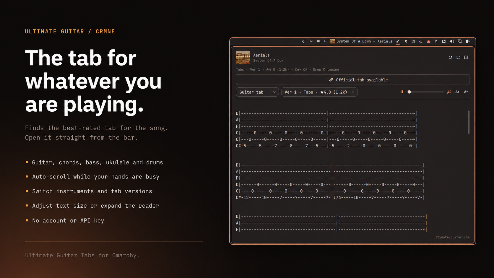

# Ultimate Guitar Tabs for Omarchy

Whatever is playing, its tab is one click away in the bar.

The widget reads the current track from MPRIS, finds the best-rated tab for it
on Ultimate Guitar, and renders it right in the shell: chords colored, columns
aligned, with auto-scroll for when both your hands are on the guitar.



`guitar icon` · `song + artist` · `version switcher` · `auto-scroll` · `text size`

## Install

```bash
omarchy plugin add https://github.com/crmne/omarchy-ultimate-guitar.git --enable --yes
omarchy bar move crmne.ultimate-guitar --section right --before omarchy.tray
```

## Requirements

- Omarchy Quattro with its Quickshell-based shell.
- Any media player exposing the standard MPRIS interface.
- `/usr/bin/python3` for the fetch helper. No extra packages, no account.

## Using it

| Action | What it does |
|---|---|
| left click | open the tab reader |
| right click | open the tab on ultimate-guitar.com |
| middle click | look the song up again, ignoring the cache |

Inside the reader: pick another version from the dropdown, start auto-scroll and
set its speed, or step the text size up and down. Scrolling by hand stops
auto-scroll. Text size and scroll speed are remembered in
`~/.local/state/omarchy/settings/ultimate-guitar.json`.

The reader opens compact; the button in its header gives the tab more room.
Bar settings expose the preferred tab type (tablature or chord sheets), the
expanded size, and whether the widget hides when nothing is playing.

## Official tabs

Ultimate Guitar's *Official* tabs are not text. They are Guitar Pro-style
binaries that only Ultimate Guitar's own interactive player can render, so the
reader cannot show them. When a song has one, the reader shows an **Official tab
available** button that opens it in your browser, where your Ultimate Guitar
session already is. Everything else -- Chords, Tabs, Bass, Ukulele, Drums -- is
plain text and renders in the shell.

## IPC

```bash
omarchy-shell crmne.ultimate-guitar status     # what is playing and what was found
omarchy-shell crmne.ultimate-guitar toggle     # open or close the reader
omarchy-shell crmne.ultimate-guitar show       # open the reader
omarchy-shell crmne.ultimate-guitar hide       # close the reader
omarchy-shell crmne.ultimate-guitar refresh    # look the song up again
omarchy-shell crmne.ultimate-guitar open       # open the tab in the browser
omarchy-shell crmne.ultimate-guitar official   # open the official tab in the browser
```

Bind `toggle` to a key in `~/.config/hypr/bindings.conf` to summon the reader
without reaching for the bar.

## Remove

```bash
omarchy plugin remove crmne.ultimate-guitar --yes
```

## Development

Put or link this repository at `~/.config/omarchy/plugins/crmne.ultimate-guitar`
and run:

```bash
omarchy-shell shell rescanPlugins
omarchy plugin enable crmne.ultimate-guitar --section right --before omarchy.tray
```

Saving any file under `~/.config/omarchy/plugins/` reloads the plugin.

The fetch helper is usable on its own, which is the quickest way to see what the
shell is working with:

```bash
bin/ug-tabs search "artist song"
bin/ug-tabs tab https://tabs.ultimate-guitar.com/tab/...
```

Matching, ranking, and rendering live in `Model.js` as pure functions:

```bash
node --test tests/model.test.js
```

Responses are cached under `~/.cache/omarchy/ultimate-guitar` -- searches for
six hours, tabs for a week. Pass `--no-cache` to bypass it.

## License

MIT. Tabs belong to their contributors and to Ultimate Guitar; this plugin only
displays the public pages their site already serves.
